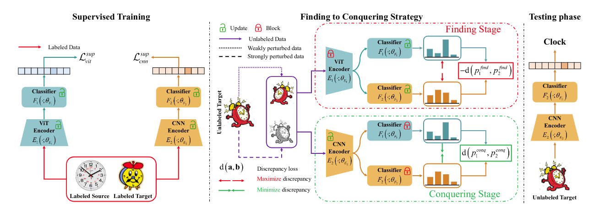
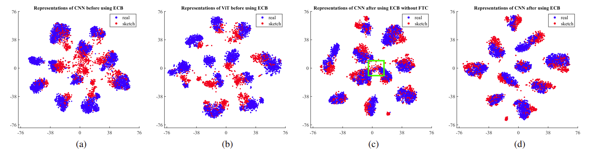
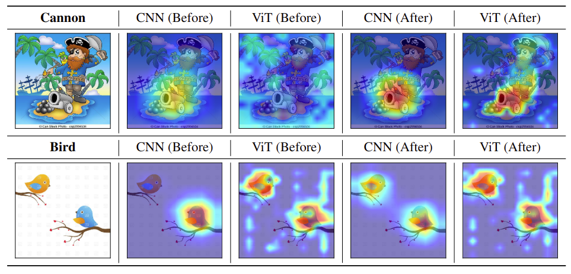

# Learning CNN on ViT: A Hybrid Model to Explicitly Class-specific Boundaries for Domain Adaptation
This repository contains the code of the ECB method for Classification in Domain Adaptation.

> Ba-Hung Ngo*, Nhat-Tuong Do-Tran*, Tuan-Ngoc Nguyen, Hae-Gon Jeon and Tae Jong Choi† 
<br>Accepted In IEEE/CVF Conference on Computer Vision and Pattern Recognition (<a href="https://cvpr.thecvf.com/Conferences/2024/">CVPR 2024</a>).

<div align="center">

[](https://openaccess.thecvf.com/content/CVPR2024/papers/Ngo_Learning_CNN_on_ViT_A_Hybrid_Model_to_Explicitly_Class-specific_CVPR_2024_paper.pdf)
[](https://openaccess.thecvf.com/content/CVPR2024/supplemental/Ngo_Learning_CNN_on_CVPR_2024_supplemental.pdf)
[](https://arxiv.org/abs/2403.18360)
[](https://dotrannhattuong.github.io/ECB/website/)
[](https://www.youtube.com/watch?v=ZYAhJLIkR_4)
[](#citation)

</div>

## Proposed Method 
<br/>
<figure id="method" style="background: #fff; padding:10px; margin:0px">
    
    
</figure>
<br/>

* <b><i>Supervised Training:</i></b> We train both ViT and CNN branches on labeled samples.
* <b><i>Finding To Conquering Strategy (FTC):</i></b> We find class-specific boundaries based on the fixed ViT Encoder E1 by maximizing discrepancy between the Classifier F1 and F2. Subsequently, the CNN Encoder E2 clusters the target features based on those class-specific boundaris by minimizing discrepancy.

## Prepare
### Dataset
Please follow the instructions in [DATASET.md](./dataset/DATASET.md) to download datasets.

### Installation
```bash
conda env create -f environment.yml
```

## Training
* The train.yaml is the config file for training our method. You can change the arguments to train Semi-Supervised Domain Adaptation (SSDA) or Unsupervised Domain Adaptation (UDA).
```bash
python train.py --cfg configs/train.yaml
```
## Evaluation
* If you need evaluate the test dataset with our pretrained model. You need to download these checkpoint.
```bash
sh download_pretrain.sh
```

* For evaluation, you need to modify the configuration arguments in test/yaml in the configs folder. These arguments are described in [CONFIG.md](./configs/CONFIG.md)
```bash
python test.py --cfg configs/test.yaml
```

## Visualization
* The visualization compares features from two networks (CNN, ViT) for the <b><i>real --> sketch</i></b>  on the <b>DomainNet</b> dataset in the 3-shot scenario, before and after adaptation with the FTC strategy.
<figure id="gradcam" style="background: #fff; margin:0px; text-align: center; padding:10px 0px">
    
</figure>
<br />

* The visualization in a few samples using GRAD-CAM technique to show to performance for CNN and ViT when applying ECB method.
<figure id="gradcam" style="background: #fff; margin:0px; text-align: center; padding:10px 0px">
    
</figure>

<a name="citation"></a>
## Citation
```
@InProceedings{
    author    = {Ngo, Ba Hung and Do-Tran, Nhat-Tuong and Nguyen, Tuan-Ngoc and Jeon, Hae-Gon and Choi, Tae Jong},
    title     = {Learning CNN on ViT: A Hybrid Model to Explicitly Class-specific Boundaries for Domain Adaptation},
    booktitle = {Proceedings of the IEEE/CVF Conference on Computer Vision and Pattern Recognition (CVPR)},
    month     = {June},
    year      = {2024},
    pages     = {28545-28554}
}
```